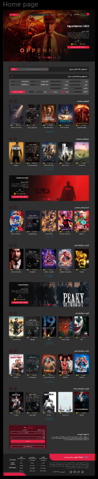
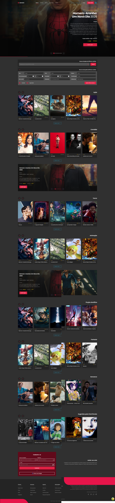

# 🎬 CineList

> A modern, modular and internationalized movie discovery platform built with React + TypeScript.

[](https://www.typescriptlang.org/)
[](https://react.dev/)
[](https://vitejs.dev/)
[](https://tanstack.com/query)
[](https://developer.themoviedb.org/)

> ⚠️ **Project status:** actively under development. Not yet deployed. See [Project Status](#-project-status) for details.

---

## 📖 Overview

**CineList** is a personal project designed to demonstrate a **scalable, modular and maintainable** front-end architecture for a movie discovery platform. It consumes the **TMDB (The Movie Database) API** to deliver real-time, multi-language movie data across a fully internationalized interface.

The project emphasizes:

- **Clean architecture** with clear separation of concerns (services, mappers, hooks, providers, components).
- **Strong typing** end-to-end with TypeScript — no `any`, no implicit casts.
- **Internationalization (i18n)** at both the UI level (8 languages) and the data level (movie titles, synopses and genres translated by the API).
- **Modular theme system** that allows adding new movie categories with minimal changes — from a single registry file.
- **Performance and DX** with TanStack Query (caching, revalidation, devtools) and Design Tokens (CSS variables).

---

## 🚧 Project Status

**CineList is currently in active development and has not been deployed yet.**

The decision to keep the project offline for now is intentional: I'm prioritizing **architecture quality, code consistency and test coverage** before shipping anything to production. Once the roadmap below reaches a stable milestone, the project will be deployed and made publicly available.

What still needs to be completed before deployment:

- [ ] Movie details page (`/movie/:id`)
- [ ] Actor page with TMDB person data
- [ ] Favorites with `localStorage` persistence
- [ ] Automated tests (Vitest + Testing Library)
- [ ] Error boundaries and graceful fallbacks
- [ ] Final performance and accessibility audit

The fact that the project is not deployed is a **deliberate engineering choice**, not a sign of abandonment — every commit reflects intentional progress toward a production-ready state.

---

## 🎨 Design Reference

The visual design is based on the **Movies – TV Shows Website (Cinema City – Community)** template, available on Figma:

🔗 [Movies – TV Shows Website (Cinema City – Community) on Figma](https://www.figma.com/design/etb83LzsWiRE2ynv4kTy4b/Movies---Tv-Shows-Website--Cinema-City---Community-?node-id=0-1&p=f&t=zk3Am3FKj0vH2ROl-0)

The layout, spacing, typography and color palette were adapted to the project's own **Design Token** system, ensuring visual consistency while keeping the codebase free from hardcoded values.

### Figma Template (Reference)

<p align="center">
  
</p>

### Current Implementation

<p align="center">
  
</p>

> 📌 The side-by-side comparison above shows the visual fidelity between the reference design and the current state of the implementation. The project is intentionally styled to match the template closely, while using a fully modular and token-based CSS architecture.

---

## ✨ Features

### 🎨 User Interface

- Fully responsive layout (mobile-first with 4 breakpoints).
- Hero carousel with autoplay, keyboard navigation and progress bar.
- Custom movie carousels driven by a **modular theme registry**.
- Curated "CineTomato" carousel with hand-picked movies.
- Movie search with simple and advanced filters.
- Featured movie spotlight with trending content.
- Registration block, multilingual header and structured footer.
- Dark theme with a Design Token system (colors, spacing, radius, shadows).

### 🌍 Internationalization

- **8 languages supported:** Portuguese, English, Spanish, French, Chinese, Arabic, Russian and Hindi.
- UI text translations organized **by feature block** (not by language), making the codebase easier to maintain.
- **Movie data also translated** — titles, synopses and genres are requested from the TMDB API in the user's current language.
- Locale-aware cache: TanStack Query keys include the locale, so switching languages refetches data without losing cache from other languages.
- RTL support for Arabic.

### 🎬 Modular Theme System

- All movie categories (general lists, genres, curated lists) are declared in a single registry (`src/constants/movieThemes.ts`).
- Adding a new carousel requires only:
  1. Adding an entry in the theme registry.
  2. Adding a translation key.
  3. Using `<MovieCarousel theme="myTheme" />`.
- Supports **general lists** (popular, upcoming, top-rated, trending), **genres** (18 TMDB genres) and **curated lists** (hand-picked movies).

### 🚀 Performance

- TanStack Query handles caching, background refetching and stale-while-revalidate.
- Genre themes are sorted by rating at the API level (`sort_by=vote_average.desc`) and filtered by vote count (`vote_count.gte=100`) to avoid obscure results.
- Lazy-loaded images.
- Dynamic scroll calculation for carousels based on the real card width.
- Conditional logger that strips `console.log` output in production.

---

## 🛠️ Tech Stack

| Category            | Technologies                                                     |
| ------------------- | ---------------------------------------------------------------- |
| **Language**        | TypeScript (strict)                                              |
| **UI**              | React 19 + Vite                                                  |
| **State / Data**    | TanStack Query v5, React Context API                             |
| **Routing**         | React Router DOM                                                 |
| **HTTP Client**     | Axios (centralized client with interceptors)                     |
| **Styling**         | CSS Modules with BEM methodology + Design Tokens (CSS variables) |
| **API**             | TMDB (The Movie Database) v3                                     |
| **Tooling**         | ESLint, Vite HMR, TanStack Query Devtools                        |
| **Version Control** | Git (feature-driven, conventional commits)                       |

---

## 🏗️ Architecture Highlights

### Layered API integration

```
┌─────────────────────────────────────────────────────────────┐
│  🖥️ COMPONENTS (Hero, MovieCarousel, FeaturedMovie)        │
│  - Consume data via hooks, unaware of data source           │
└─────────────────────────────────────────────────────────────┘
                              ⬇️
┌─────────────────────────────────────────────────────────────┐
│  🪝 HOOKS (useMoviesByTheme, useTrendingMovies, ...)        │
│  - Handle state, cache, loading and errors                  │
│  - Locale-aware query keys                                  │
└─────────────────────────────────────────────────────────────┘
                              ⬇️
┌─────────────────────────────────────────────────────────────┐
│  📦 SERVICES (tmdbService.ts)                               │
│  - Pure functions, transform API data to domain model       │
│  - Strongly typed response contracts                        │
└─────────────────────────────────────────────────────────────┘
                              ⬇️
┌─────────────────────────────────────────────────────────────┐
│  🌐 HTTP CLIENT (apiClient.ts)                              │
│  - Centralized Axios config with interceptors               │
│  - Auth injection, dev logs, error handling                 │
└─────────────────────────────────────────────────────────────┘
```

### Directory structure (partial)

```
src/
├── components/          # UI blocks (Hero, MovieCarousel, Header, ...)
├── constants/           # movieThemes registry, languages, TMDB locale
├── context/             # LanguageContext (i18n state)
├── data/                # curatedLists (hand-picked movie IDs)
├── hooks/               # useCarousel, useMoviesByTheme, ...
├── locales/             # translations by feature block
├── providers/           # QueryProvider (TanStack Query)
├── services/            # apiClient, tmdbService, mappers
├── styles/              # tokens.css (design tokens)
├── types/               # shared TypeScript contracts
└── utils/               # logger, helpers
```

---

## 🚀 Getting Started

### Prerequisites

- Node.js 18+
- A free [TMDB](https://www.themoviedb.org/signup) account with an API key (v3 auth)

### Installation

```bash
# Clone the repository
git clone https://github.com/michael-ribeiro-fs/cinelist-project.git
cd cinelist-project

# Install dependencies
npm install

# Create the .env file
cp .env.example .env
```

Edit `.env` and add your TMDB credentials:

```env
VITE_TMDB_API_KEY=your_api_key_here
VITE_TMDB_ACCESS_TOKEN=your_access_token_here
VITE_TMDB_BASE_URL=https://api.themoviedb.org/3
VITE_TMDB_IMAGE_URL=https://image.tmdb.org/t/p/w500
VITE_USE_API=true
```

### Run the development server

```bash
npm run dev
```

Open [http://localhost:3000](http://localhost:3000) in your browser.

### Build for production

```bash
npm run build
npm run preview
```

---

## 🧩 Adding a New Movie Theme

Adding a new carousel is a 3-step process — no touching service or component logic.

**1. Register the theme** in `src/constants/movieThemes.ts`:

```ts
anime: { key: 'anime', source: { kind: 'genre', genreId: 16 } },
```

**2. Add the translation** in `src/locales/movieCarousel/movieCarousel.ts` (8 languages):

```ts
themes: {
  anime: 'Animes',
}
```

**3. Use it** in `src/pages/Home.tsx`:

```tsx
<MovieCarousel theme="anime" />
```

> 📖 Full documentation: [`src/constants/movieThemes.README.md`](./src/constants/movieThemes.README.md)

---

## 🗺️ Roadmap

- [ ] Movie details page (`/movie/:id`)
- [ ] Actor page with TMDB person data
- [ ] Favorites with `localStorage` persistence
- [ ] Automated tests (Vitest + Testing Library)
- [ ] Dark/light theme toggle
- [ ] Deployment to Vercel

---

## 👨‍💻 Development Philosophy

This project is built with a few strong principles in mind:

- **Type safety first** — TypeScript is used to eliminate whole classes of bugs at compile time.
- **Separation of concerns** — components don't know how data is fetched; services don't know how data is rendered.
- **DRY, but readable** — abstraction is preferred when it reduces duplication without hiding intent.
- **Documentation as code** — architecture decisions are documented next to the code (e.g., `movieThemes.README.md`).
- **AI as a multiplier, not a crutch** — AI tools are used to accelerate development, but every line is reviewed, understood and owned.

---

## 📄 License

This project is for personal and portfolio purposes. Movie data is provided by [TMDB](https://www.themoviedb.org/), which is not affiliated with this project.

---

**Built with ❤️ by [Michael Ribeiro](https://github.com/michael-ribeiro-fs)**
